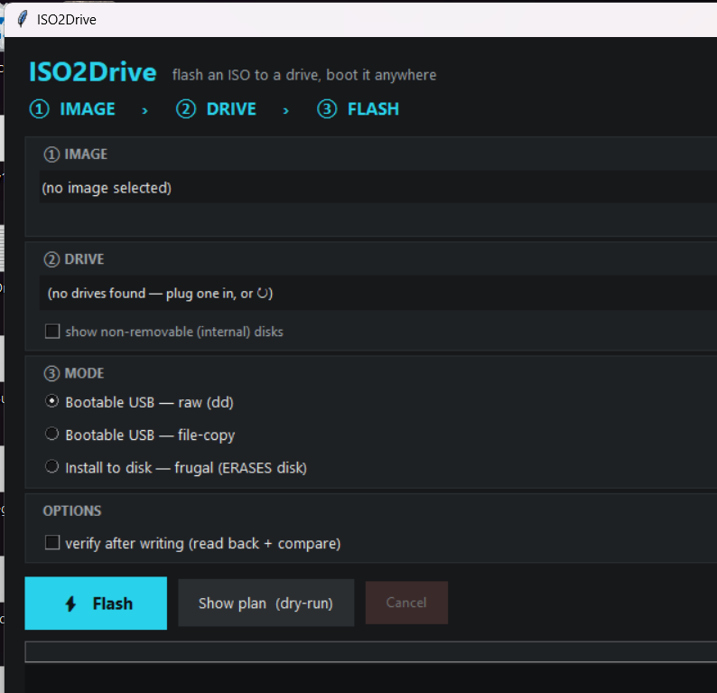

# ISO2Drive

Flash a Linux ISO to a drive and boot it anywhere — a **frugal-install** tool with
two frontends over one shared C core:

- **AppImage (Linux host)** — *greenfield*: owns a target disk, installs GRUB for
  UEFI + BIOS with two `grub-install` calls.
- **Windows installer** — *brownfield*: adds Linux-ISO booting alongside an existing
  Windows install (Grub2Win-style), no repartition, Windows boot files untouched.

Both frontends emit the **same** `grub.cfg` and `entries.d/*.cfg`, so the fiddly
per-distro boot logic lives in exactly one place.

## How the boot menu recognizes things

Recognition is by *identity*, never by disk enumeration order (which changes the
moment a USB is plugged in). Everything is found with `search --file`:

| Thing | Signature |
|-------|-----------|
| This tool's ISO store | `search --file /iso2drive/.iso2drive-store` |
| Windows (UEFI) | `search --file /EFI/Microsoft/Boot/bootmgfw.efi` |
| Windows (BIOS) | `search --file /bootmgr` |

The master `grub.cfg` is static and never changes; each ISO you add drops one
`entries.d/<slug>.cfg` that the master sources in a loop.

## Layout

```
include/frugal/   public headers (core API + backend interface + ui)
src/core/         PORTABLE core — no platform code
  util.c          logging, strings, files, run_capture
  isolist.c       "does path X exist in the ISO?" over a tar listing
  profile.c       per-distro detection + boot profiles (edit me)
  grubcfg.c       master grub.cfg + per-ISO entry generation
  ui.c            Etcher-style banner + three-step strip + progress bar
  flash.c         raw ISO->device streaming + read-back verify
src/backend/
  backend_linux.c    AppImage host — partition + grub-install + raw flash [REAL]
  backend_windows.c  Windows host — ESP + bcdedit orchestration + raw flash [REAL]
  winutil.c          Windows probes (firmware, Secure Boot, BitLocker, ...)
  winusb.c           Windows raw PhysicalDrive access (lock/dismount/write)
src/main.c        CLI frontend
```

## Build

MSYS2/MinGW (Windows) or any Linux:

```bash
make
```

Produces `iso2drive.exe` (Windows) or `iso2drive` (Linux). The Makefile auto-selects
the host backend from `$(OS)`.

## GUI

A small Etcher-style desktop front-end (Python + tkinter) that drives the same CLI:



**Windows:** double-click **`ISO2Drive-GUI.vbs`** to open it with no console (via
`pythonw`), or grab the standalone **`iso2drive-gui.exe`** from the
[latest release](https://github.com/Captain-Beefheart/ISO2Drive/releases) (no Python
needed). Otherwise, run it directly:

```bash
python gui/iso2drive_gui.py
```

Either way the GUI needs the `iso2drive` engine — keep an `iso2drive*.exe` (or the
release binary) in the same folder, the repo root, or on your `PATH`. The bundled
exe carries its own.

Pick an image, pick a drive, choose a mode — **raw USB**, **file-copy USB**, or
**install to disk (frugal)** — then **Show plan** to preview the exact command, or
**Flash** to run it (behind a confirmation). It streams the engine's output and a
progress bar, hides the system disk and non-removable drives by default (an
"advanced" toggle reveals fixed disks), and — since flashing needs privileges —
offers a "Relaunch as Administrator" button on Windows (use `sudo` on Linux).

It finds the `iso2drive` binary next to the script, in the repo root, or on your
`PATH`, so build it (`make`) or drop a release binary alongside first. Needs a
Python with tkinter (standard on python.org builds; on MSYS2 it's the mingw python).

## Usage

```bash
iso2drive gen-cfg out/grub.cfg              # emit the master grub.cfg
iso2drive detect ubuntu-24.04.iso           # distro detection
iso2drive doctor                            # report firmware / boot environment
iso2drive add /mnt/data/iso2drive ubuntu-24.04.iso   # stage an ISO (no boot code)
```

**Everything that rewrites boot config is a dry-run until you pass `--commit`.**

### Greenfield — Linux (blank disk, end to end)

`provision` wipes a blank disk, lays down GPT (1 MiB BIOS-boot + 300 MiB FAT32 ESP +
ext4 data), mounts it, stages the ISO, and installs GRUB for **both** UEFI and BIOS —
one command. Run as root; **dry-run until `--commit`**:

```bash
iso2drive provision /dev/sdb ubuntu-24.04.iso --commit
```

Or just partition/format/mount a disk, then stage separately:

```bash
iso2drive format-disk /dev/sdb --commit
iso2drive add /run/iso2drive/data/iso2drive ubuntu-24.04.iso --esp /run/iso2drive/esp --disk /dev/sdb --commit
```

Safety: greenfield commands **refuse the running system disk** and any disk with
mounted partitions, print the target's current layout before touching it, and need
`sgdisk` (gptfdisk), `mkfs.fat` (dosfstools), `mkfs.ext4` (e2fsprogs), and
`partprobe` (parted). `add --esp` alone (no partitioning) still works if you've
prepared the partitions yourself.

### Persistence (Linux)

Add a writable overlay so a frugally-booted live session remembers changes across
reboots. Linux backend only (it needs `mkfs.ext4`), for Ubuntu/casper and Debian live:

```bash
iso2drive provision /dev/sdb ubuntu-24.04.iso --persist 4G --commit
iso2drive add /mnt/data/iso2drive debian-12.iso --persist 2G --commit
```

This creates an ext4 image labelled `casper-rw` (Ubuntu) or `persistence` (Debian —
with a `/ union` persistence.conf) at the root of the store partition, and generates
a direct-boot **`(persistent)`** entry carrying the right kernel arg (`persistent` /
`persistence`). Other families, and the Windows backend, don't support persistence
(no ext4 tooling); `--persist` is ignored there with a warning.

### Flash boot code — Windows (brownfield dual-boot)

Preview from any prompt, then apply from an **elevated** prompt:

```bash
iso2drive add C:\iso2drive ubuntu-24.04.iso --flash
iso2drive add C:\iso2drive ubuntu-24.04.iso --flash --commit
```

The Windows backend matches whatever firmware mode Windows already uses:

- **UEFI** — mounts the existing ESP, copies `grubx64.efi` into `\EFI\ISO2Drive\`,
  and adds a firmware boot entry with `bcdedit`. When **Secure Boot** is on and a
  signed shim is present, it registers `shimx64.efi` (which chain-loads GRUB) so
  it boots without disabling Secure Boot. Windows Boot Manager stays intact;
  GRUB's menu chainloads Windows.
- **BIOS** — leaves the MBR alone and adds a `bcdedit` *bootsector* entry that
  chainloads a grub2 loader dropped on `C:` (EasyBCD-style).

`doctor` (and the start of every flash) reports **Secure Boot / Fast Startup /
BitLocker**, which are the usual reasons a Windows-side Linux dual-boot fails.

#### GRUB binaries (`assets/grub/`)

Windows has no `grub-install`, so the GRUB binaries must be supplied. Check what's
present (and what each is for) any time:

```bash
iso2drive assets                       # report present/missing under assets/grub
iso2drive assets --fetch               # build/assemble them (needs a grub toolchain)
```

`--fetch` runs [`scripts/get-grub-assets.sh`](scripts/get-grub-assets.sh), which
**builds** `grubx64.efi` with `grub-mkstandalone` (baking in
[`efi-prelude.cfg`](assets/grub/efi-prelude.cfg) so it finds our menu), **copies**
the locally installed Microsoft-signed shim (`shim-signed`) for Secure Boot, and
picks up `g2ldr`/`g2ldr.mbr` from a local Grub2Win. It's meant to run on the Linux
box the AppImage targets (or MSYS2 with a grub package). The binaries aren't
committed — they're GPL and must be built with our config — so run the script (or
drop your own into `assets/grub/`, overridable with `--assets <dir>`):

```
assets/grub/
  efi-prelude.cfg            # committed (text) — baked into grubx64.efi
  x86_64-efi/grubx64.efi     # built by the script
  x86_64-efi/shimx64.efi     # optional, Secure Boot (+ mmx64.efi)
  i386-pc/g2ldr, g2ldr.mbr   # BIOS
```

## Bootable USB (raw / dd-style flash)

A separate mode from frugal install: write an ISO **byte-for-byte** onto a whole
device, the way Balena Etcher does. Modern Linux ISOs are isohybrid, so the result
boots directly on both BIOS and UEFI.

```bash
iso2drive list-disks                                       # find the target safely
iso2drive write-usb ubuntu-24.04.iso /dev/sdb              # dry-run preview (Linux)
iso2drive write-usb ubuntu-24.04.iso 2 --commit --verify   # flash + verify (Windows: drive #)
```

- Device: Linux `/dev/sdX`; Windows a drive number, `PhysicalDriveN`, or `\\.\PhysicalDriveN`.
- **Dry-run until `--commit`**; `--commit` needs root (Linux) / an elevated prompt (Windows).
- **Refuses the system disk** outright, and refuses non-removable drives unless `--force`.
- `--verify` reads the device back and compares it against the ISO.
- A live progress bar shows write (and verify) progress.

### File-copy USB (Rufus "ISO mode")

The alternative to raw flash: partition + format the USB, **copy the ISO's files**,
and make it boot — leaving a normal, writable filesystem. Use it for Windows ISOs
or when you want to add/remove files on the stick. On **both** backends:

```bash
iso2drive copy-usb ubuntu-24.04.iso /dev/sdb --commit          # Linux, FAT32
iso2drive copy-usb win11.iso 2 --fs fat32 --commit             # Windows, drive 2
```

- One active partition; `--fs fat32` (default, UEFI + BIOS), `exfat`/`ntfs`
  (data / large files, not UEFI-bootable — UEFI firmware only reads FAT).
- **UEFI** boots via the ISO's copied `/EFI/BOOT/BOOTX64.EFI` (present in most ISOs).
- **BIOS**: Linux (isolinux) ISOs are converted to `syslinux` + MBR boot code;
  Windows ISOs BIOS-boot via their own `bootmgr` (active partition).
- **Big Windows WIMs**: `install.wim` > 4 GB is auto-split to `install.swm` so it
  fits FAT32 (Linux: `wimlib-imagex`; Windows: `dism /Split-Image`).
- Backends: Linux uses `parted` + `mkfs` + `bsdtar` (+ `syslinux`); Windows uses
  `diskpart` + `tar`. Best-effort — `syslinux` must match the ISO's isolinux
  version, and ISOs hiding their EFI loader in an el-torito `efi.img` need the raw path.

## What's real vs stubbed

**Real:** distro detection; the master `grub.cfg`; per-ISO entry generation; the
store/marker layout; ISO copy; **greenfield disk partitioning** (Linux: `sgdisk` +
`mkfs` + mount, with a full dry-run preview and system-disk guards); **`install_grub`
on both backends** — Linux (`grub-install` x2) and Windows (ESP + `bcdedit`
orchestration, gated on the bundled GRUB binaries above); **bootable-USB raw flash**
on both backends (`list-disks` + `write-usb`, with progress bar, read-back verify,
and system-disk / non-removable guards); **persistence** (Linux: labelled ext4
writable image for Ubuntu/casper + Debian live, `--persist-label` override, and the
`(persistent)` entry); **file-copy USB on both backends** (Linux `parted`+`syslinux`,
Windows `diskpart`, with `install.wim` auto-split); **Secure Boot shim** on the
Windows UEFI install; and an `assets` checker + [build script](scripts/get-grub-assets.sh).

**Not yet implemented:** Windows persistence (needs an ext4 image library).

## Per-distro boot logic

Each generated entry tries the ISO's own `/boot/grub/loopback.cfg` first (the
robust path most modern ISOs support), and only falls back to a hand-crafted
kernel/cmdline from `src/core/profile.c`. That table is a **starting point** —
validate it against real ISOs; **GLIM (GRUB2 Live ISO Multiboot)** is the
authoritative reference. Families marked "needs loopback.cfg" (Fedora, Arch,
openSUSE) only boot ISOs that ship one.

## Roadmap

1. **Windows persistence** — needs an ext4 image library (e.g. lwext4) to create
   the writable store from Windows; currently Linux-only.
2. **Dedicated persistence partition** — a real labelled partition option in the
   greenfield `provision` flow, as an alternative to the file image.
3. **Validate against real images** — the profile table (`src/core/profile.c`) and
   every `--commit` path still need checking on real ISOs / hardware.

## Testing status

The read-only and dry-run paths are verified on the dev box (see git history).
Every **`--commit`** path — `grub-install`, raw USB write, disk partitioning,
persistence, and file-copy USB — has been compiled and dry-run-checked but not yet
run end-to-end on real Linux hardware. That's the main outstanding validation.
